<div align="center">
  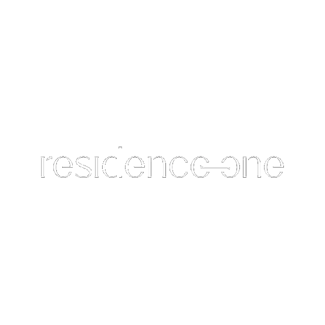
  
  # 🏛️ Residence 01 — AI-Generated Architectural Concept & Cinematic Showcase

  <p align="center">
    <b>Demostración web de alto impacto que combina Arquitectura Conceptual Generada por IA (GenAI) con Desarrollo Web Creativo de Vanguardia.</b>
  </p>

  <p align="center">
    <a href="[https://architect-showcase-two.vercel.app/](https://architect-showcase-two.vercel.app/)" target="_blank">
      
    </a>
  </p>

  <p align="center">
    <a href="[https://nextjs.org](https://nextjs.org)"></a>
    <a href="[https://www.typescriptlang.org/](https://www.typescriptlang.org/)"></a>
    <a href="[https://threejs.org/](https://threejs.org/)"></a>
    <a href="[https://greensock.com/gsap/](https://greensock.com/gsap/)"></a>
    <a href="[https://tailwindcss.com/](https://tailwindcss.com/)"></a>
    <a href="[https://pika.art](https://pika.art)"></a>
  </p>
</div>

---

## 📸 Galería del Showcase (16 Screenshots)

<div align="center">
  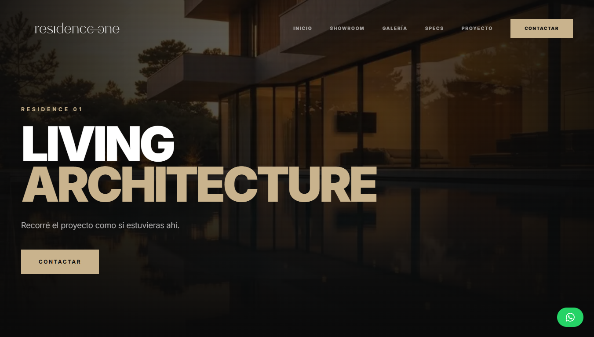
</div>

<br />

| 01. Hero & Branding | 02. Showroom Cinematográfico |
| :---: | :---: |
|  | 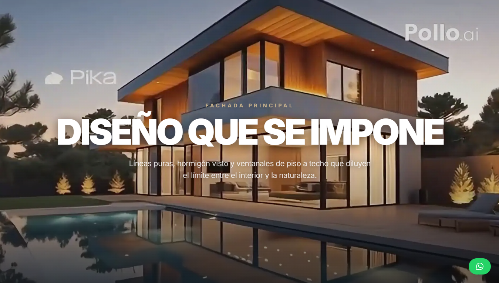 |
| **Living Architecture / Landing** | **Scrub de Video IA — Beat 1** |

| 03. Vista Nocturna | 04. Suite Principal |
| :---: | :---: |
| 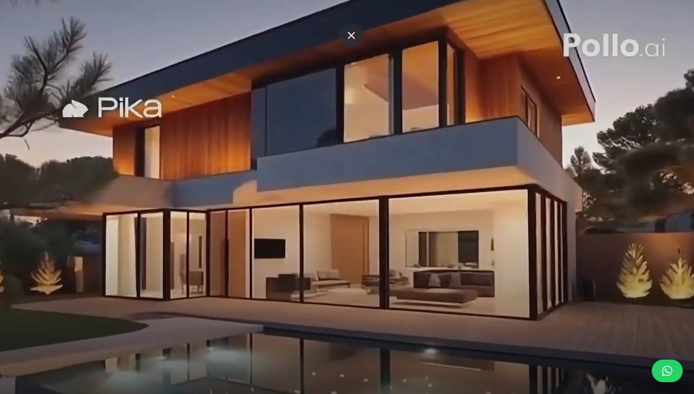 | 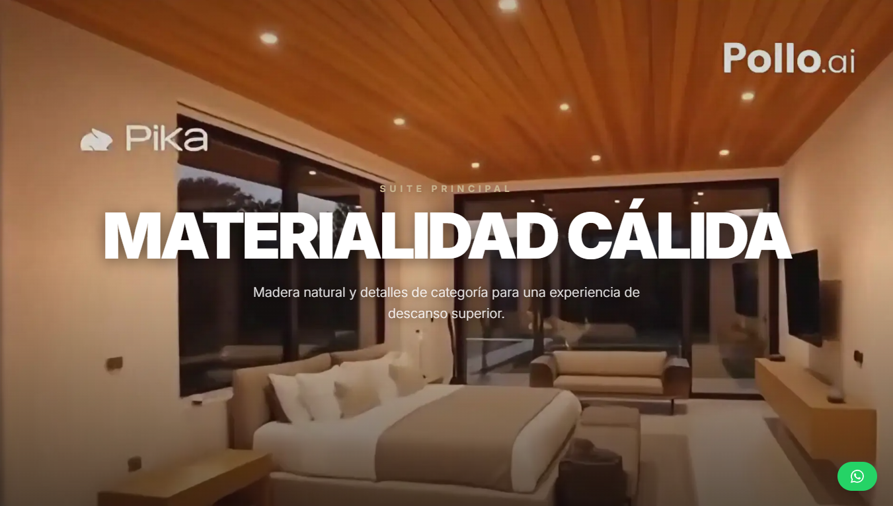 |
| **Render IA & Espejo de Agua** | **Interiorismo Generativo / Interiores** |

| 05. Vista Aérea | 06. Integración Natural |
| :---: | :---: |
| 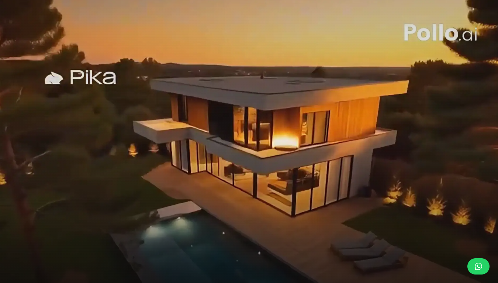 | 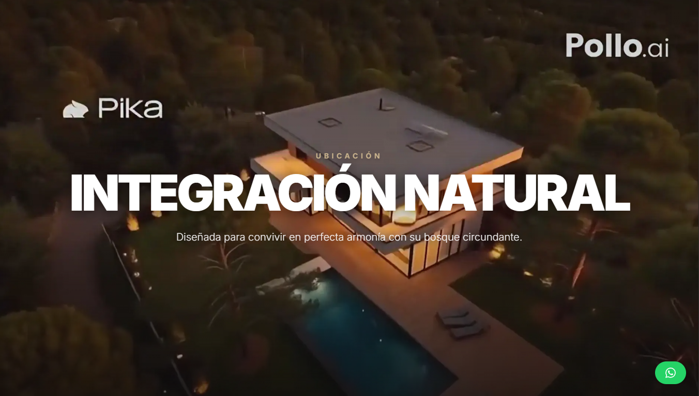 |
| **Arquitectura Atardecer** | **Entorno de Bosque / Ubicación** |

| 07. Ficha Técnica Interactiva | 08. Portada del Dossier Técnico |
| :---: | :---: |
| 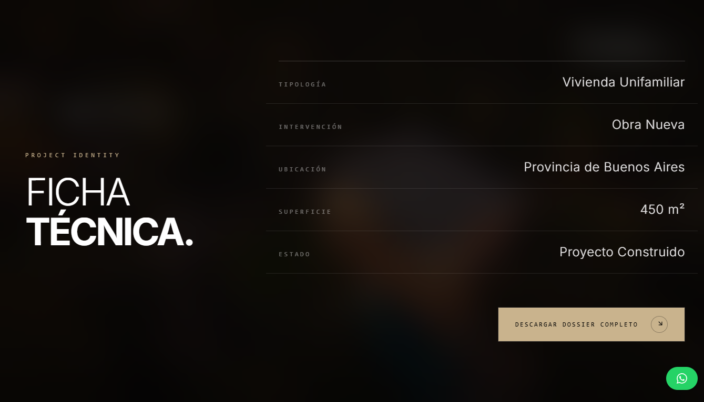 | 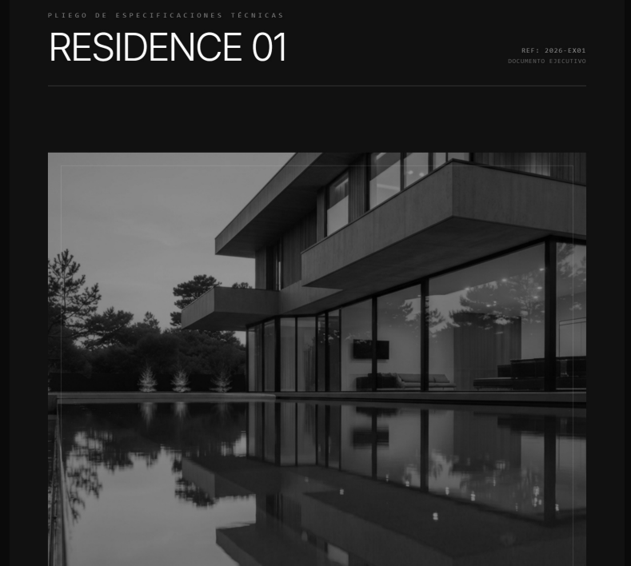 |
| **Project Identity & Especificaciones** | **Documento Ejecutivo 2026-EX01** |

| 09. Visor de Memoria Estructural | 10. Galería 3D WebGL (Ext.) |
| :---: | :---: |
| 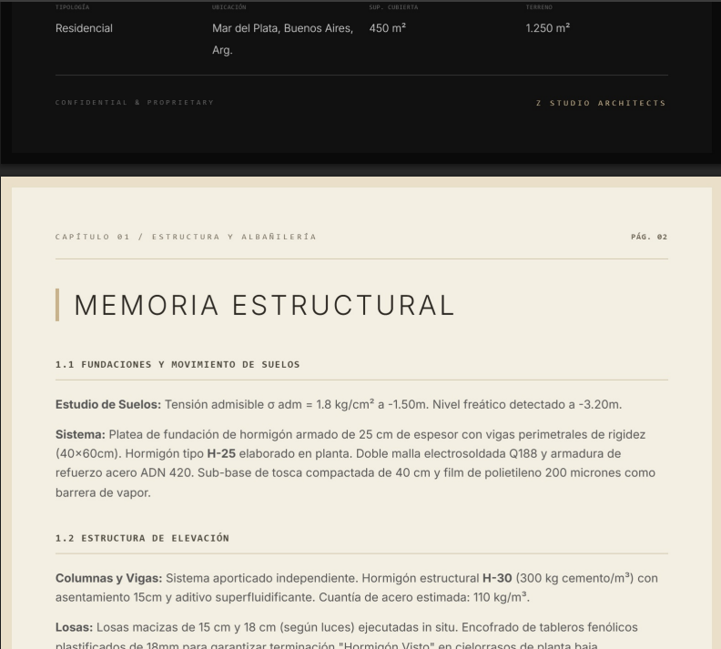 | 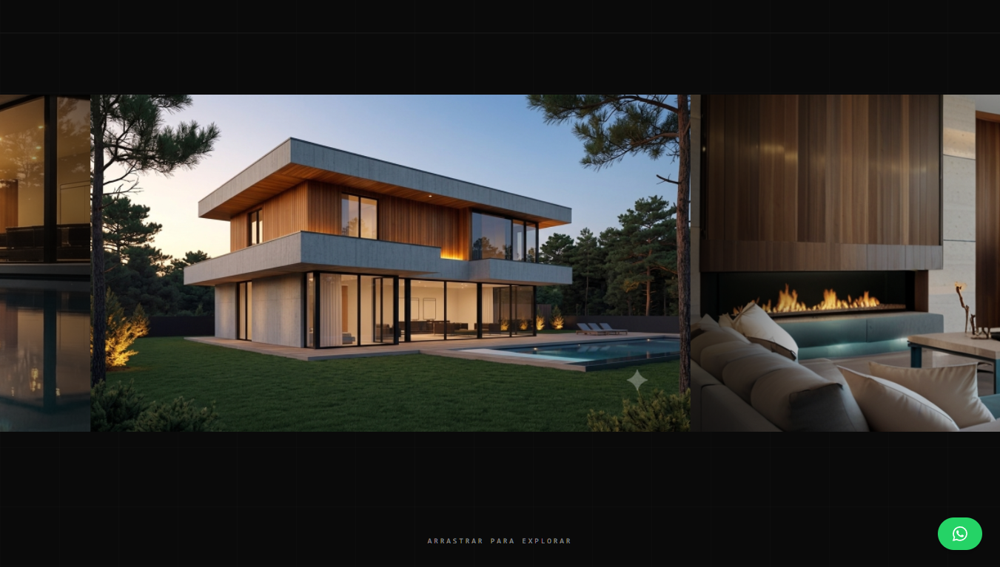 |
| **Estructuras, Fundaciones y MEP** | **Shader de Deformación / Arrastre** |

| 11. Galería 3D WebGL (Int.) | 12. Anatomía — Vista Lateral |
| :---: | :---: |
| 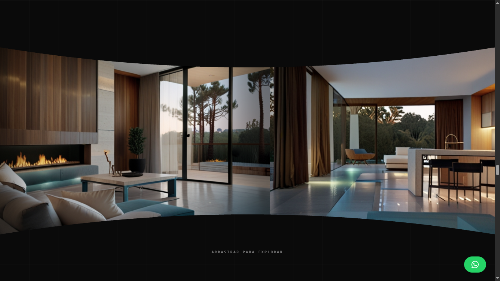 | 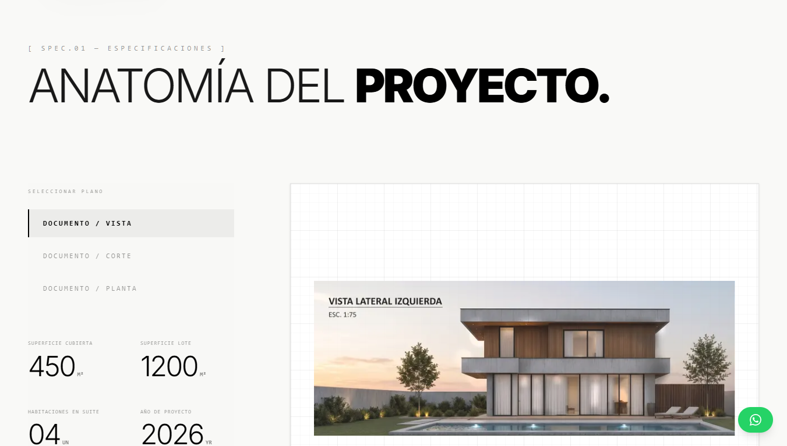 |
| **Efecto de Curvatura Inercial** | **Selección de Planos Interactivas** |

| 13. Anatomía — Planta | 14. Proceso Constructivo |
| :---: | :---: |
| 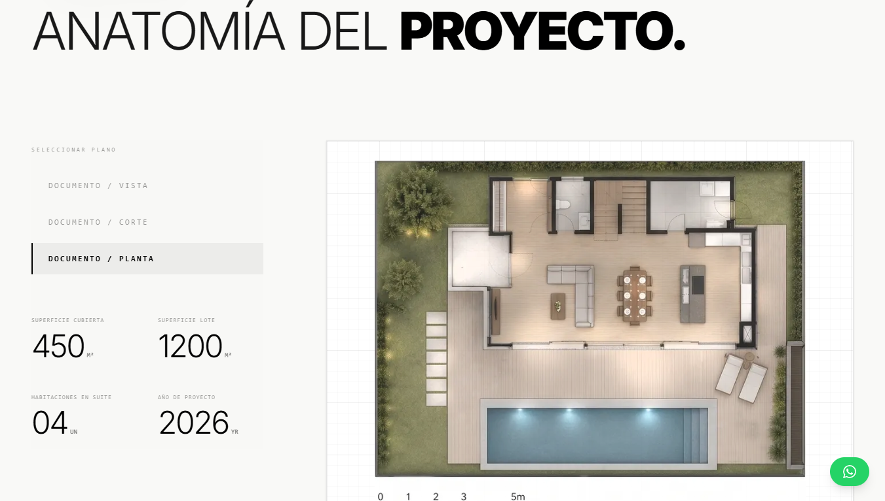 | 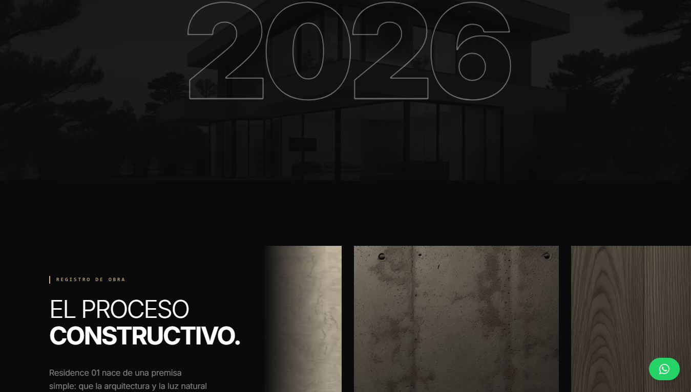 |
| **Distribución Arquitectónica** | **Marquee de Obra & Materialidad** |

| 15. Formulario de Contacto | 16. Transición de Proyecto |
| :---: | :---: |
| 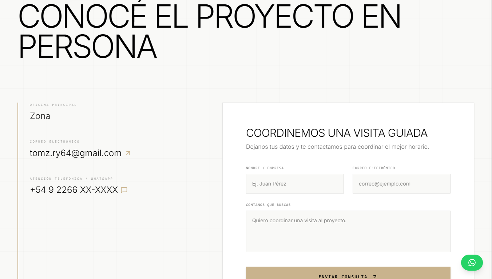 | 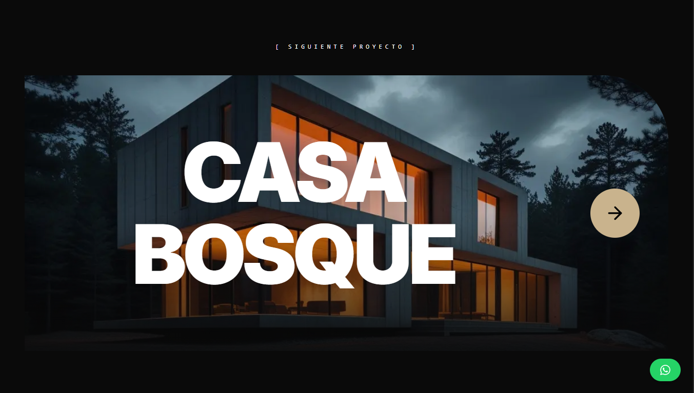 |
| **Agendamiento de Visita Guiada** | **Siguiente Concepto: Casa Bosque** |

---

## 💡 Concepto del Proyecto & Workflow IA

**Residence 01** (`REF: 2026-EX01`) es una **prueba de concepto integral** que explora el futuro de la presentación inmobiliaria y de estudio de arquitectura.

A diferencia de los sitios tradicionales que dependen de obras físicas fotografiadas, todo el material visual, cinematográfico y técnico de esta experiencia fue **diseñado y generado con Inteligencia Artificial**:

* **🎬 Generación Cinematográfica:** Video y secuencias de movimiento generados mediante **Pika** y **Pollo.ai**, procesados y divididos en una secuencia de **556 fotogramas WebP** para control de scroll fluido sin latencia de video nativo.
* **🖼️ Arquitectura & Renders Sintéticos:** Concepción visual y ambientación de la residencia utilizando herramientas de difusión generativa para arquitectura.
* **📄 Pliego & Dossier Técnico Automatizado:** Generación de memoria descriptiva, cálculos de ingeniería simulados (fundaciones, mampostería HCCA, instalaciones MEP y domótica KNX) formateados en un visor interactivo y listo para descarga.

🌐 **Demo en vivo:** [https://architect-showcase-two.vercel.app/](https://architect-showcase-two.vercel.app/)

---

## 📄 Módulo de Dossier Técnico & Pliego de Especificaciones

La plataforma demuestra cómo un sitio web de arquitectura de lujo puede integrar documentación técnica real junto al recorrido visual de alta fidelidad:

### 📑 Documento Ejecutivo (Pliego 2026-EX01)
* **Memoria Estructural:** Especificaciones de platea de fundación en hormigón armado H-25, vigas de rigidez ($40 \times 60\text{ cm}$), estructura de elevación con columnas y vigas H-30, y cielorrasos en hormigón visto.
* **Envolvente & Materiales:** Muros exteriores en bloques HCCA Retak ($K=0.60\text{ W/m²K}$), carpinterías Aluar A40/Altezza con RPT, doble vidriado hermético Low-E, y solados en microcemento Piedra París y Roble de Eslavonia.
* **Ingeniería MEP & SmartHome:** Piso radiante con caldera Baxi, refrigeración VRV Daikin/Mitsubishi, termotanque solar de 300L y domótica integrada bajo protocolo **KNX** (DALI, cortinas Somfy, clima).

---

## 🚀 Key Features de Ingeniería Frontend

1. **🎬 Scroll Scrubbing Cinematográfico (GSAP + Canvas 2D):** Renderizado de alto rendimiento en Canvas 2D que sincroniza los 556 WebP frames generados con IA al scroll del usuario de forma ultra fluida.
2. **🌀 Custom WebGL Shaders (React Three Fiber):** Galería 3D interactiva en Three.js con un *Custom Shader Material (GLSL)* que aplica deformación física y curvatura inercial de lente basada en la velocidad del drag.
3. **📐 Visor Interactivo de Planos (Framer Motion):** Selector dinámico para alternar de forma inmediata entre vistas, cortes y plantas arquitectónicas sobre un canvas técnico estilo papel milimetrado.
4. **📄 Módulo de Descarga e Inspección de Dossier:** Interfaz editorial para explorar la ficha técnica completa del proyecto conceptual.
5. **⚡ Control Inercial & Smooth Scroll:** Sincronización perfecta de Lenis Scroll con GSAP ScrollTrigger Pins para evitar bloqueos de pantalla.

---

## 🛠️ Estructura del Repositorio

```text
architect-showcase/
├── public/
│   ├── logo.png
│   ├── next-project.jpg
│   ├── readme/                  # Screenshots del portfolio (1.png a 16.png)
│   └── render/                  # Assets gráficos y secuencias
│       ├── frames/              # Secuencia de 556 frames WebP para el Showroom (GenAI)
│       ├── gallery_*.jpg        # Renders HD para la Galería 3D WebGL
│       └── ...                  # Planos, cortes e imágenes del dossier
├── src/
│   ├── app/                     # App Router (layout, page, globals.css)
│   ├── components/
│   │   ├── layout/              # Navbar, Footer, SmoothScroll (Lenis)
│   │   ├── sections/            # Hero, CinematicShowroom, TechnicalSpecs, Project, Contact
│   │   └── ui/                  # DossierDownload, ProductCard, Modales
│   ├── config/                  # site.ts (Fuente de datos y textos)
│   └── hooks/                   # Custom Hooks
└── package.json
```

---

## ⚙️ Guía de Instalación y Ejecución Local

1. **Clonar el repositorio:**
   ```bash
   git clone https://github.com/Tommyx66/architect-showcase.git
   cd architect-showcase
   ```

2. **Instalar dependencias:**
   ```bash
   npm install
   ```

3. **Ejecutar en entorno de desarrollo:**
   ```bash
   npm run dev
   ```

4. **Abrir en el navegador:**
   Navegar a `http://localhost:3000`

---

## 🛡️ Licencia & Autoría

Desarrollado como concepto de arquitectura web de vanguardia y Frontend Creativo por **Tomás Zarriello**.  
Assets conceptuales generados mediante IA (Pika, Pollo.ai, Midjourney/Diffusers). Todos los derechos reservados.